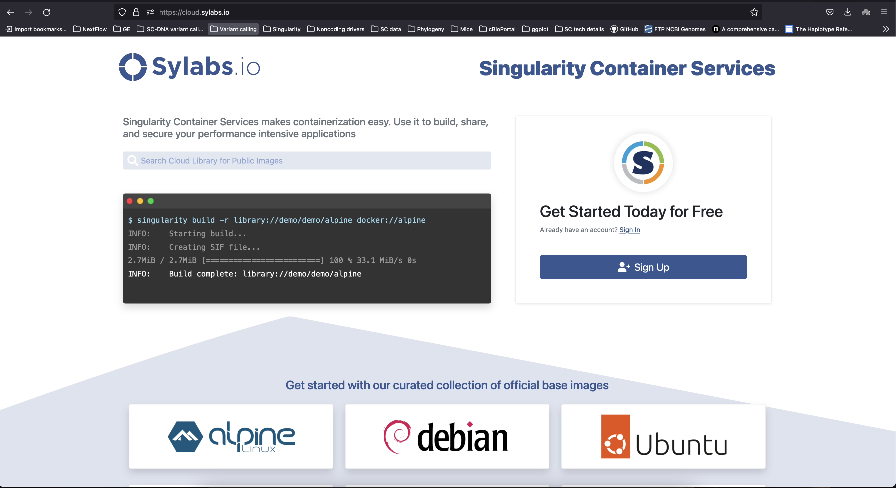

# Singularity cloud tutorial
This is a small tutorial showing how to build images in singularity cloud. The main advantage of this system is that you don't have to install anything on your computer to build an image. However, if you'd like to install singularity on your computer, follow this links: [Mac](https://singularity.lbl.gov/install-mac), [Linux](https://singularity.lbl.gov/install-linux), [Windows](https://singularity.lbl.gov/install-windows).

This tutorial also assumes that you're somewhat familiar with what singularity is _in general terms_. If you're not, there is a [tutorial](https://singularity-tutorial.github.io/).

## STEP 1
Navigate to [https://cloud.sylabs.io/](https://cloud.sylabs.io/).

## STEP 2
Sign up and log in.

## STEP 3
You'll be directed to the dashboard. Click on **Remote Builder**.

## STEP 4
Copy and paste code from `samtools.def` to the black area.

## STEP 5
Fill in **Repository** field with *project_name/samtools_in_a_box*. project_name is the same value as in the Project field to the left. For your future containers other names instead of samtools_in_a_box can be used.

## STEP 6
Press "Submit Build" button.

## STEP 7
Wait till status changes to "Success".

## STEP 8
Click on "View image"

## STEP 9
Congratulations! Container was successfully created. Now you can download it to your computer with "Download" button or pull it on HPC/computer via pull command which is revealed if you press "Pull Command" button.
